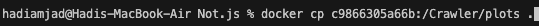

# Not.js: Blocking Tracking JavaScript at the Function Granularity

`Blocking Tracking JavaScript at the Function Granularity
Abdul Haddi Amjad, Shaoor Munir, Zubair Shafiq, Muhammad Ali Gulzar
ACM Conference on Computer and Communications Security (CCS), 2024`

# Artifiacts Badge Request:
## 1. Available
This is a public repository, accessible to everyone.

## 2. Functional
We have generated a Dockerfile to run end-to-end Node.js and follow the methodology mentioned in the paper. You need to input the website to be crawled, and you will receive output in the form of surrogate scripts for the website with tracking functions neutralized.

## 3. Reproducible
We reproduce the results illustrated in the figures and tables from the paper as follows:
1. Table 3
2. Table 4
3. Table 5
4. Table 6
5. Figure 7
6. Figure 8

# Installation
### 0. Minimum requirements
These artifacts are rigrously tested on Macbook with following configuration:
1. Intel core i7 processor
2. 4-core CPU
3. 16 GB Ram
4. 500 GB SSD

> Note that the Docker base image in the dockerfile supports `amd64` i.e, x86-64 machines.

### 1. Clone the the github repository
`git clone https://github.com/hadiamjad/Not.js.git` and move in the directory using `cd` command

### 2. Build the docker using Dockerfile
> Note that the Docker base image in the dockerfile supports `amd64` i.e, x86-64 machines.

- Make sure Docker has these minimum requirements:
    

- This command 
`docker build -t notjs .` 
will build docker image using Dockerfile.
  Expected time: 50 seconds
  

- Run the docker image using 
`docker run -it notjs`
  

- Try running `ls` command in the docker terminal and it will list all the files inside this repository.

### 3. OPTIONAL: Tmux session (You can skip this step if you are already familiar with tmux)
In this tutorial we will be using tmux sessions to create server and client sessions for testing.
Some important commands:
- To create new session `tmux new -s {session-name}`
- To leave existing session `Cntrl + b` followed by `d`
- To join existing session `tmux a -t {session-name}`

### 4. Functional Badge: Running Above Methodology
> Make sure your docker build was successful.

#### Step 1: Run server
- Create new tmux session for running the server 
`tmux new -s server`
This will automatically join the session as well.

- Run the following command 
`bash server.sh` 
This will install the necessary pakages and start the server.
 

- Leave the `server` session using `Cntrl + b` followed by `d`.

#### Step 2: Run client
- Create new tmux session for running the client 
`tmux new -s client`
This will automatically join the session as well.

- Run the following command:
`bash client.sh`
This will perform the following actions:
    1. Crawl the website listed in `test.csv`. Currently, it has two websites: `canvas.com` and `bidtheatre.com`.
    2. Install the `not.js` model.
    3. Generate a `page graph` for the website.
    4. Extract `features` from the graphs.
    5. Generate `surrogates` for the websites.
    6. Map the surrogates into a `folder structure compatible with Google Chrome`.

    > Expected time: Approximately 7 minutes. This time may increase depending on the number of websites and their activity, which directly impacts the time required for graph generation.

    > Note: Some websites might crash beacuse they prevent the attachment of hooks to their APIs.

    

#### Step 3: Collecting surrogates
- Now, within the same tmux session named client, run 
`tree server/surrogates` 
to print the surrogates into a folder structure compatible with Google Chrome.

### 5. Reproducible Badge: Generating Figures and Tables
> Make sure your docker build was successful.
- Run 
`bash reproducible.sh` 
to generate the tables and figures. It will do the following:

    #### Downloading models and dataset
    

    #### Table 3
    
    

    #### Table 4
    
    

    > The last two rows are the accuracies of other tools. 

    ### Table 5
    > In this table last-row is the standard one already computed above.
    
    

    <!-- ### Table 6
    
     -->

    ### Generating plots
    

    ### Retrieving plots
    You can run the following command in LOCAL REPOSITORY SHELL to copy the plots folder to local machine:

    `docker cp {container_id}:/Crawler/plots .` 

    
    
    > The container id is located on the docker shell:
`root@{container-id}:/Crawler/plots#`
    

### 6. Artifact Support
- contact: hadiamjad@vt.edu